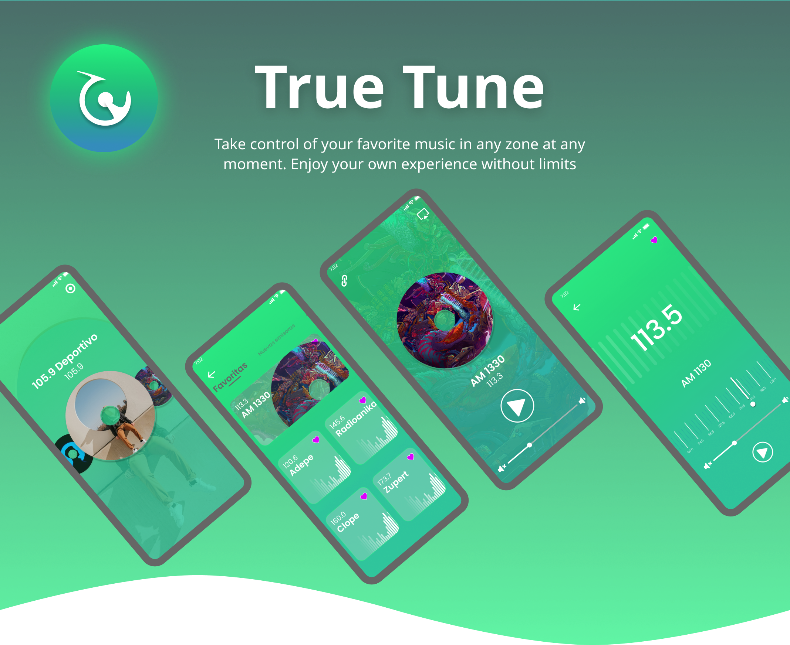

  

# True Tune

Mobile App concept created using Flutter. A Web-based radio player, with a simple UI and a few custom animations.

---

### About the App

  - True Tune is a Web Radio App where you can find exceptional radio stations!
  
  - You can see all radios in a GridView, so you can get quickly to the music you love. Or you can filter by your favorite radios, always a safe choice.
  
  - Not sure what is your mood at the moment? Hear a preview of any radio by pressing a radio grid item on the GridView Page. Choose the best song playing all across included radios!
  
  - The App was designed to be user-friendly and intuitive, with a simple but appealing interface. There are custom animations developed to ease the interaction and provide reliable feedback.

### Some Screens

      

### Animations in action

      

### Designer

The UI was designed by [Gabriel Rueda](https://www.behance.net/gallery/148117955/True-tune-UXUI). Check out his socials to find more UI designs and cool illustrations!   
[Behance](https://www.behance.net/juandiruedag1)  -  [LinkedIn](https://www.linkedin.com/in/juandiegogabrielrueda/)  -  [Pinterest](https://co.pinterest.com/jruedagalvis/)

---

### State Management

This App uses Provider as State Management approach

### Packages used

| Dart Package | Version Used | What for? |
| --- | --- | --- |
| [Provider](https://pub.dev/packages/provider) | ^6.0.3 | State Management |
| [Flutter SVG](https://pub.dev/packages/flutter_svg) | ^1.1.0 | Render SVG icons |
| [Rive](https://pub.dev/packages/rive) | ^0.9.0 | Display SVG animations |
| [Flutter Radio Player](https://pub.dev/packages/flutter_radio_player) | ^1.1.0 | Manage audio stream state |